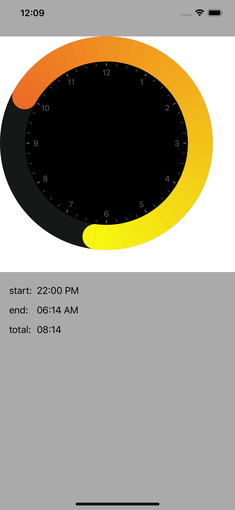

# Clock Slider Control

## Overview

This sample iOS project contains a single view with a custom control, a Clock Slider Control. This control is similar in appearance to the circular clock found inside the native Clock app, on the Bedtime tab.

The control provides the ability for the user to specify a range of time, in hours, via dragging sliders around the circumference of a circle (clock face). The start time can be fixed or can be changeable by the user.

The clock can be fixed to allow only up to a single 12 hour revolution, or up to 24 hours (2 revolutions). The color changes when the user passes the 12-hour boundary.

Gradient colors are used for arc between the start time and the finish time. There are four colors which are configurable:

1. start time (first 12 hours)
2. end time (first 12 hours)
3. start time (second 12 hours)
4. end time (second 12 hours)

By default, there is a thumbnail circle on either end of the arc which matches the gradient color. This thumbnail circle may be replaced with a custom image instead of the default solid color.

The color of the ticks along the clock face is configurable. The font used to label the hours along the clock face is configurable. There is a single large label which may sit in the center of the clock face and tell the selected range (in hours and minutes). This lable is not visible by default.

There is an action for the custom control called `valueChanged`. A view control may bind to this action and receive information from the slider such as start time, end time, elapsed time.
